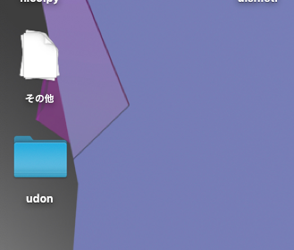
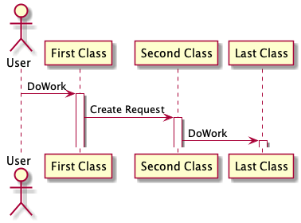

# 特徴

文書生成言語といえば、Markdownと\raw{\LaTeX}の2つが挙げられる。
Markdownは可読性が高く、また\raw{\LaTeX}は体裁の整った文書を作成できる。
そこで、優しいMarkdown言語で原稿を書き、そのMarkdownファイルを体裁の整った\raw{\LaTeX}に変換する。
この手法により、より簡単に美しい文書が作成できる。

また、文書校正機能により読みやすい文書の作成を目指す。

# 文法

文法は主にMarkdown言語に準ずる([https://www.markdownguide.org/basic-syntax/](https://www.markdownguide.org/basic-syntax/)参照)。
しかし、いくつかの変更点が存在する。
それらの変更点を以下のセクションにて説明する。

## 図

挿入する画像は、src/image内に保存する。

``` {#lst:sample-img caption=図の挿入}
{#fig:label}
```

{#fig:label}

## 表

``` {#lst:sample-tbl caption=表の挿入}
| i | サイコロの目 |
|------:|:------:|
| 1 | 3 |
| 2 | 2 |
| 3 | 6 |
| 4 | 5 |
| 5 | 1 |
| 6 | 4 |
| 7 | 2 |
| 8 | 6 |

:caption {#tbl:label}
```

| i | サイコロの目 |
|------:|:------:|
| 1 | 3 |
| 2 | 2 |
| 3 | 6 |
| 4 | 5 |
| 5 | 1 |
| 6 | 4 |
| 7 | 2 |
| 8 | 6 |

:caption {#tbl:label}

## コード

~~~ {#lst:sample-code caption=コードの挿入}
``` {#lst:label caption=caption}
console.log('Hello World')
```
~~~

``` {#lst:label caption=caption}
console.log('Hello World')
```

## UML図

src/uml内に*.umlと名付けたPlantUMLファイルを、コンパイルして挿入する。

``` {#lst:sample-UML caption=UML図の挿入}
{#fig:label}
```

{#fig:label-uml}

## 参照

``` {#lst:ref caption=参照}
[@fig:label]
[@tbl:label]
[@lst:label]
```

[@fig:label]
[@tbl:label]
[@lst:label]

## LaTeX文の挿入

``` {#lst:sample-raw caption=\LaTeX文の挿入}
\raw{\LaTeX}
```

\raw{\LaTeX}
